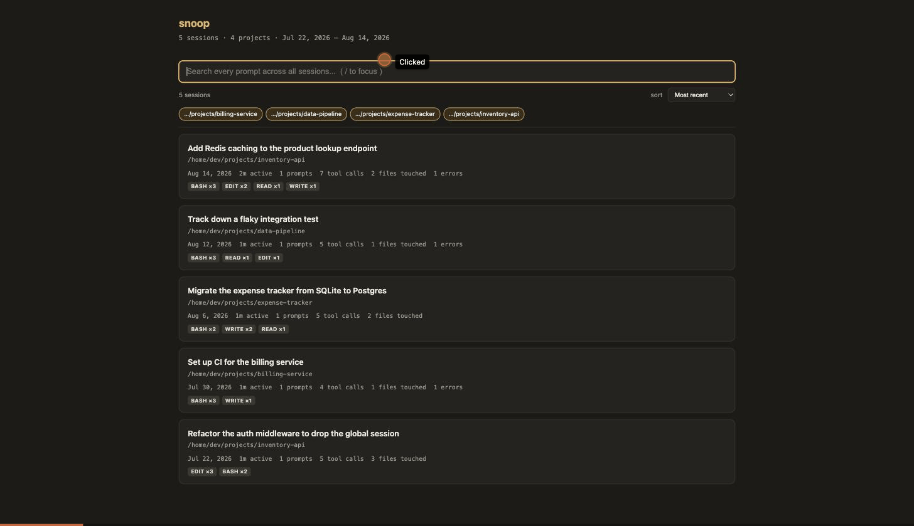

# snoop

A searchable archive of everything you've done with Claude Code.

Every conversation is already on your disk — Claude Code writes each one to
`~/.claude/projects/…/<guid>.jsonl` and keeps it forever. snoop turns that pile
of JSONL into something you can actually use: search every prompt you've ever
typed across every project, then open any session and see what the agent did,
which files it changed, what it ran, and what it cost.

One Python script, standard library only. It generates static HTML and opens it
— no server, no dependencies, no network.



```
python3 snoop.py          # searchable index of every session
```

Search for what you remember asking → open the session → the summary panel tells
you what happened. That's the whole flow.

## Usage

```
python3 snoop.py              # searchable index of every session on disk
python3 snoop.py <guid>       # open one session by GUID (or a unique prefix)
python3 snoop.py --deep       # index full transcripts, not just prompts
python3 snoop.py --list       # plain terminal listing
python3 snoop.py --out DIR    # write somewhere other than ~/.snoop
python3 snoop.py --no-open    # generate without launching a browser
```

With no arguments, snoop builds a **cross-session index**: every session you've
ever run, across every project, searchable by prompt. This is usually where you
want to start — you rarely know the GUID of the session you're looking for, but
you do remember roughly what you asked.

The `<guid>` is the same session id you'd pass to `claude --resume <guid>`.
Claude Code stores each conversation as `~/.claude/projects/<encoded-cwd>/<guid>.jsonl`;
snoop searches all project folders, so you don't need to be in the original
working directory or know which project it belongs to.

Output goes to `~/.snoop/` (`index.html` plus one self-contained page per
session under `sessions/`). Rebuilding the entire archive takes well under a
second, so snoop just regenerates everything on each run — there's no cache to
invalidate and no stale state.

## Search scope: prompts vs. `--deep`

By default the index searches **your prompts and session titles**. That's a
deliberate trade: prompts are a tiny fraction of the data but the highest-signal
text for "which session was that?", so the index stays small enough to load
instantly no matter how large your archive grows.

`--deep` additionally indexes assistant responses, tool inputs, and tool
results — so you can find a command you ran or a line of code Claude wrote, not
just what you asked. On a sample archive that's the difference between a 66 KB
and a 1.4 MB index page; both are fine, but only the first one stays fine at
100× the size.

## Cost estimates

The summary panel prices each session from the token counts Claude Code records
per message — input, output, and separately cache reads and cache writes, since
those bill at very different rates (a read is ~0.1× the input rate; a write
carries a premium that depends on its TTL). In agentic sessions cache reads
dominate everything else by orders of magnitude, so a naive
`input_tokens × rate` calculation is wildly wrong — snoop prices all four
buckets per model.

Figures are **estimates at public list prices** (rates in `MODEL_RATES`, current
as of 2026-08-19); a negotiated rate makes the real number lower, and
locally-generated `<synthetic>` messages are excluded since they never hit the
API. Edit the table in `snoop.py` if your rates differ.

## Fully offline

Everything is static HTML with all data inlined — no server, no network
requests, no CDN, no fonts, no telemetry. Pages navigate between each other with
ordinary relative links, so the whole thing works opened straight from disk over
`file://` (which blocks `fetch()` to local files, hence the inlining rather than
lazy loading).

## Features

### Index page
- **Search every prompt across every session**, with matching snippets shown
  inline so you can see *why* a session matched before opening it.
- **Session cards** — title, project, date, active time, prompt/tool-call
  counts, files touched, error count, and the tools most used.
- **Filter by project**, sort by recency, duration, tool-call volume, or
  best match.
- **Active time, not wall-clock span** — a session resumed the next day spans
  24h but may hold ten minutes of work. Idle gaps over 5 minutes are excluded;
  hover the duration to see the full span.

### Session page
- **"What happened" summary** — a panel at the top answering the questions you
  actually opened the transcript with: active time, prompts, tool calls, **files
  touched**, **commands run**, tool errors, token usage, and estimated cost.
  Every file, command, and error links straight to the moment it happened.
- **Full transcript** — every user message, assistant response, and tool
  call/result rendered in order, grouped into conversation turns.
- **Sidebar navigation** — one entry per prompt/response/tool call, each with
  a timestamp, a type badge, and a preview. Click to jump to it in the
  transcript.
- **Filtering** — toggle categories on/off (user prompts, assistant
  responses, thinking, or any individual tool by name) from the sidebar
  filter panel. Slash-command scaffolding (`/model`, etc.) is filtered out
  by default since it's rarely useful.
- **Search** — full-text search across messages and tool input/output, with
  match count and prev/next navigation (`/` to focus the search box, `Enter`
  / `Shift+Enter` to step through matches).
- **JSON viewer** — tool inputs and JSON-shaped tool results render as a
  collapsible tree instead of a wall of text; long plain-text output gets a
  "Show more" toggle.
- **Session events log** — a separate panel (off by default) for
  lower-level events: mode changes, permission-mode changes, file history
  snapshots, tool availability changes, turn durations.
- **Resizable sidebar** — drag the divider to widen it (useful for long MCP
  tool names); double-click the divider to reset.
- **Back to index** link when the page was built as part of an index.
- Light/dark theme follows your system setting.

## Requirements

Python 3, standard library only. No `pip install` needed.
